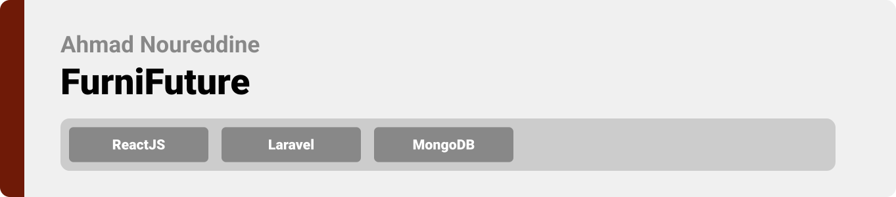
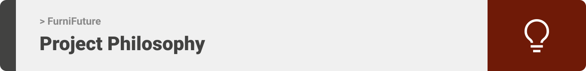
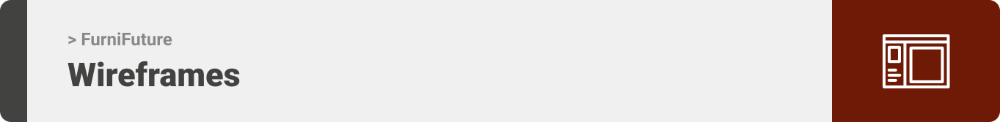
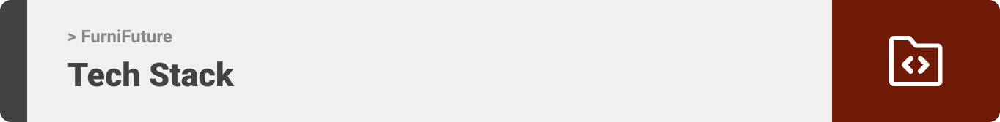
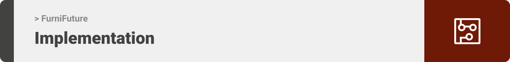
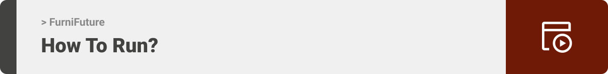

<div align="center">

>FurniFuture is a website to buy and sell furniture online while being able to connect with shipping services. 


**[PROJECT PHILOSOPHY](https://github.com/julescript/well_app#-project-philosophy) • [WIREFRAMES](https://github.com/julescript/well_app#-wireframes) • [TECH STACK](https://github.com/julescript/well_app#-tech-stack) • [IMPLEMENTATION](https://github.com/julescript/well_app#-impplementation) • [HOW TO RUN?](https://github.com/julescript/well_app#-how-to-run)**

</div>

<br><br>




> The FurniFuture is an efficient website that connects furniture buyers and sellers online. FurniFuture is more than just a buy and sell website; it offers a great oppurtinity for users to connect with shipping services.
> 
> The website encourges people who can work in shipping furniture to create their own profiles so that they can have greater chances in finding nearby clients.

### User Stories
- As a user, I want to browse furniture for sale, so that I can find the best product
- As a user, I want to sell my used furniture to find a quick purchase
- As a user, I want to promote my furniture shipping service, so that I can find more clients online

<br><br>



> This design was planned before on paper, then moved to Figma app for the fine details.
Note that i didn't use any styling library or theme, all from scratch and using pure css modules

| Landing  | Buy  |
| -----------------| -----|
|  |  |

| Delivery  | Cart  |
| -----------------| -----|
|  |  |


<br><br>



Here's a brief high-level overview of the tech stack the Well app uses:

- This project uses ReactJs Library for the frontend (https://reactjs.org/). ReactJS is a free and open-source front-end JavaScript library for building user interfaces based on UI components.
- For persistent storage (database), the app uses MongoDB (https://www.mongodb.com/) database management program which allows the app to manage document-oriented information, store or retrieve information.
- This project uses Laravel FrameWork for the backend (https://laravel.com/)
- The app uses the font ["poppins"](https://fonts.google.com/specimen/Poppins) as its main font, and the design of the app adheres to the material design guidelines.


<br><br>


> Uing the above mentioned tech stacks and the wireframes build with figma from the user sotries we have, the implementation of the app is shown as below, these are screenshots from the real app

| Landing  | Buy  |
| -----------------| -----|
|  |  |


<br><br>



> This is an example of how you may give instructions on setting up your project locally.
To get a local copy up and running follow these simple example steps.

### Prerequisites

This is an example of how to list things you need to use the software and how to install them.
* npm
  ```sh
  npm install npm@latest -g
  ```

### Installation

_Below is an example of how you can instruct your audience on installing and setting up your app. This template doesn't rely on any external dependencies or services._

1. Get a free API Key at [https://example.com](https://example.com)
2. Clone the repo
   ```sh
   git clone https://github.com/your_username_/Project-Name.git
   ```
3. Install NPM packages
   ```sh
   npm install
   ```
4. Enter your API in `config.js`
   ```js
   const API_KEY = 'ENTER YOUR API';
   ```


