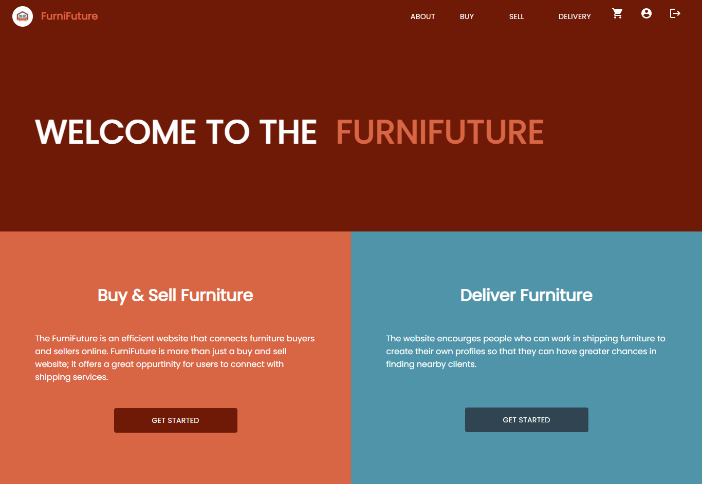

<div align="center">

>FurniFuture is a website to buy and sell furniture online while being able to connect with shipping services. 


**[PROJECT PHILOSOPHY](https://github.com/julescript/well_app#-project-philosophy) • [WIREFRAMES](https://github.com/julescript/well_app#-wireframes) • [TECH STACK](https://github.com/julescript/well_app#-tech-stack) • [IMPLEMENTATION](https://github.com/julescript/well_app#-impplementation) • [HOW TO RUN?](https://github.com/julescript/well_app#-how-to-run)**

</div>

<br><br>


>Users can search for furniture and shipping services, both of which can be added to the cart.
>
>The website gives space to those who provide shipping services to create shipping accounts, taking part in the available shipping services on the website.

### User Stories
- As a user, I want to browse furniture for sale, so that I can find the product I seek for
- As a user, I want to sell my used furniture to find a quick purchase
- As a user, I want to promote my furniture shipping service, so that I can find more clients online

<br><br>


> This design was planned before on paper, then moved to Figma app for the fine details.
Note that i didn't use any styling library or theme, all from scratch and using pure css modules

| Landing  | Buy  |
| -----------------| -----|
| |  |


<br><br>


Here's a brief high-level overview of the tech stack the Well app uses:

- This project uses ["ReactJs"](https://reactjs.org/) Library for the frontend.
- For persistent storage (database), the app uses ["MongoDB"](https://www.mongodb.com/).
- This project uses ["Laravel"](https://laravel.com/) FrameWork for the backend.
- To query and manipulate data from MongoDB, this project uses ["Jenssengers"](https://jenssegers.com/) This library extends the original Laravel classes, so it uses exactly the same methods.
- For Push notification, this project uses ["Firebase Cloud Messaging"](http://firebase.google.com/) for realtime database.                
- The website uses the font ["Poppins"](https://fonts.google.com/specimen/Poppins) as its main font, and the design of the app adheres to the material design guidelines.


<br><br>


> Uing the above mentioned tech stacks and the wireframes build with figma from the user sotries we have, the implementation of the app is shown as below, these are screenshots from the real app


| Landing  | Buy  |
| -----------------| -----|
|  |  |


<hr/>


| Buy  | Open Modal |
| -----------------| -----|
| |  |

| Cart  | Purchase |
| -----------------| -----|
|  |  |

| Delivery  | Click Create Button  |
| -----------------| -----|
|  |  |

| Create Shipping Profile |  Shipping Profile  |
| -----------------| -----|
|  |  |


<br><br>


> This is an example of how you may give instructions on setting up your project locally.
To get a local copy up and running follow these simple example steps.

### Prerequisites

This is an example of how to list things you need to use the software and how to install them.

* download and install ["ReactJs"](https://reactjs.org/)

* update npm

```sh
npm install npm@latest -g
```


### Installation

_Below is an example of how you can instruct your audience on installing and setting up your app. This template doesn't rely on any external dependencies or services._

1. Clone the repo
   ```sh
   git clone https://github.com/AhmadNourelddine/furnifuture.git
   ```
2. Install NPM packages
   ```sh
   cd furnifuture/furnifuture-frontend
   npm install
   ```
3. Run the start up command
   ```sh
   npm start
   ```

